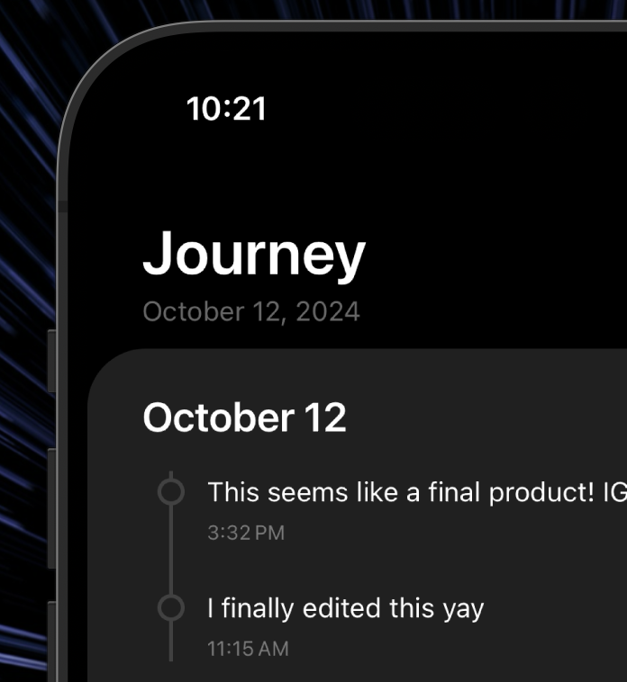
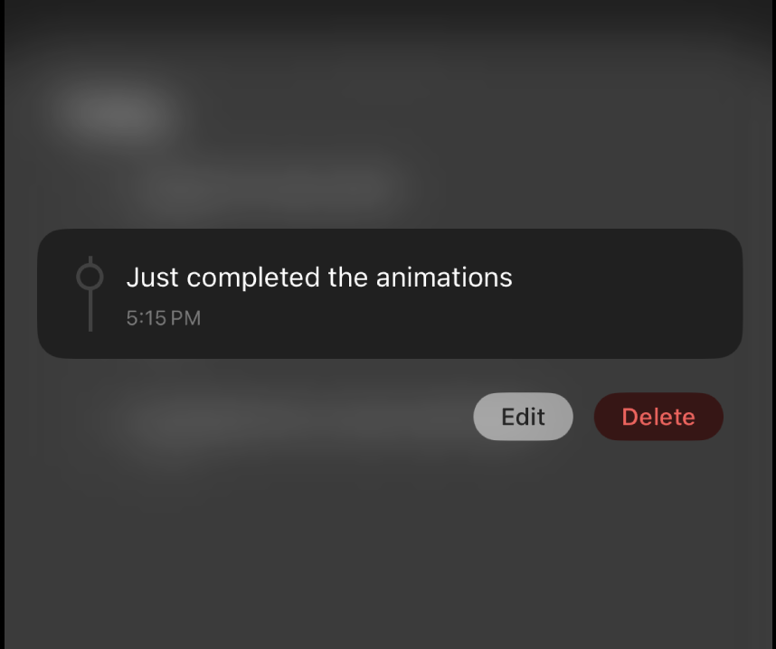
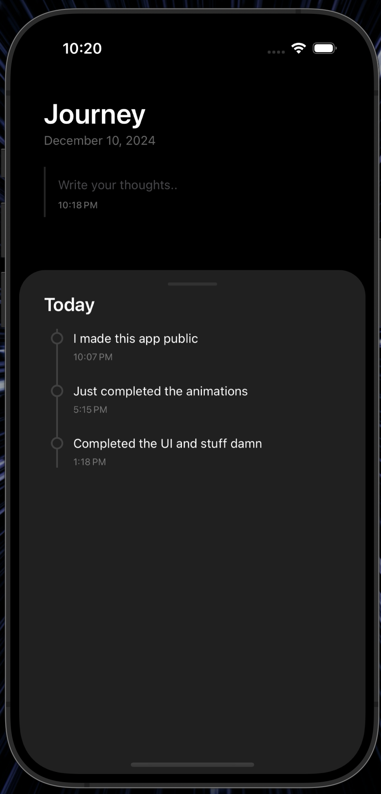

# Journey
This is Journey, a coolest journal app! 🚀 Built with React Native, this app is here to make your journaling experience as smooth as butter. This is my journey of learning React Native.

Here's why Journey is your new best friend:
- **Timeline View:** Travel back in time and relive your epic moments with our chronological timeline. No DeLorean required.
- **Native Experience:** Leverages native components and animations for a seamless and responsive user experience.
- **Secure:** Keep your thoughts safe, No sign-in, no bs. Everything is stored locally.
- **Offline Mode:** Journal anytime, anywhere, even without an internet connection.

So, what are you waiting for? Start documenting your awesomeness today!

## Screenshots







> ![INFO]
> Made using React Native, Expo and Nativewind

## Setup

To set up the project locally, follow these steps:

1. **Clone the repository:**
```sh
git clone https://github.com/rahuletto/journey.git
cd journey
```

2. **Install dependencies:**
```
bun install
```

3. **Run the server:**
```sh
bun run start
```

- _Android_
> You need Android SDK to be installed on your machine
```sh
bun run android
```

- _iOS_
> You need to have iOS environment in your XCode in your Mac system.
```sh
bun run ios
```

## Contribution
We welcome contributions! To contribute, follow these steps:

1. Fork the repository.
2. Create a new branch:
```sh
git checkout -b feat/name
```
3. Make changes and commit
```sh
git commit -m "Commit message"
```
4. Push to your branch
```sh
git push origin feat/name
```
5. Create a pull requests

## License
This project is licensed under the MIT License - see the LICENSE file for details.